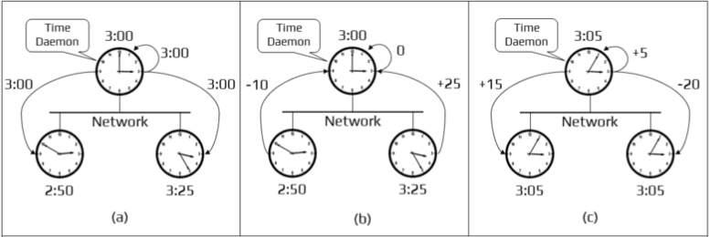
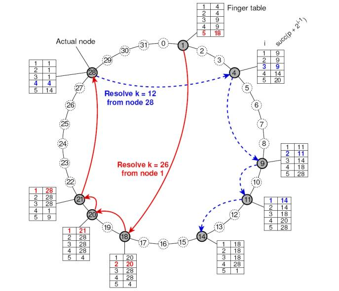
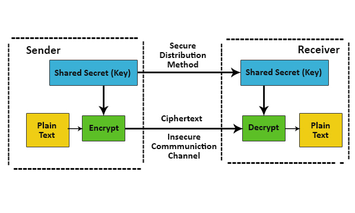
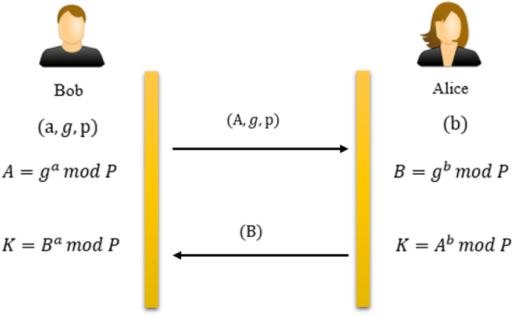
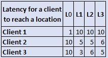
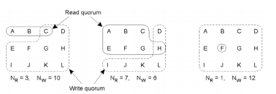
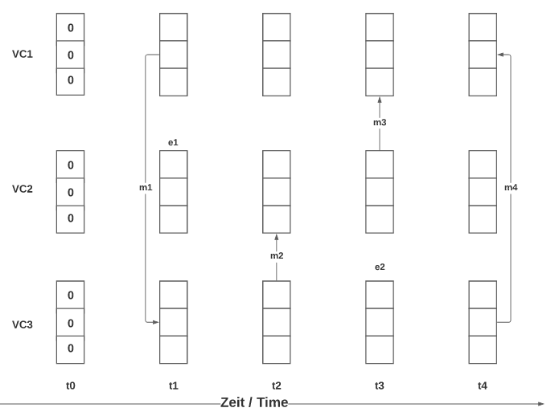

<a name="readme-top"></a>

# Algorithms for Distributed Systems

Everything that has to be adapted in the code has a ````# Fill in```` in the same line

## Table of Contents

1. [Berkeley](#berkeley)
2. [Chord System](#chordSystem)
3. [Crypto System](#cryptoSystem)
4. [Diffie Hellman](#diffieHellman)
5. [Greedy Server Placement](#greedyServerPlacement)
6. [Lamport's Logical Clocks](#lamportsLogicalClocks)
7. [Read Write Quorums](#readWriteQuorums)
8. [Vector Clock](#vectorClock)

## [Berkeley](https://github.com/ukalto/VSVO-Algorithms/blob/master/Berkeley.py)

<a name="berkeley"/>

The Berkeley algorithm is a method of clock synchronisation in distributed computing which assumes no machine has an accurate time source.

### How to use?
Every time has to be typed in the following format: 3:30pm = 1530 | 11:20am 1120

<ol>
    <li>Start the Berkeley.py program</li>
    <li>First type in the time for the Time Daemon (server_a_time)</li>
    <li>Secondly type in the time for the Server B (server_b_time)</li>
    <li>Thirdly type in the time for the Server C (server_c_time)</li>
</ol>

### Example:



(Source: [ResearchGate](https://www.google.com/url?sa=i&url=https%3A%2F%2Fwww.researchgate.net%2Ffigure%2FBerkeleys-Algorithm-Working_fig9_359685729&psig=AOvVaw1CsE9XVH3gPPDYwIIKCPbF&ust=1683503903976000&source=images&cd=vfe&ved=0CBEQjRxqFwoTCMCGrfPy4f4CFQAAAAAdAAAAABAJ))

<p align="right">(<a href="#readme-top">Back to Top</a>)</p>

## [Chord System](https://github.com/ukalto/VSVO-Algorithms/blob/master/ChordSystem.py)

<a name="chordSystem"/>

In computing, Chord is a protocol and algorithm for a peer-to-peer distributed hash table.
A distributed hash table stores key-value pairs by assigning keys to different computers (known as "nodes");
a node will store the values for all the keys for which it is responsible.
Chord specifies how keys are assigned to nodes, and how a node can discover the value for a given key by first locating the node responsible for that key.

### How to use?

<ol>
    <li>Start the ChordSystem.py program</li>
    <li>First you have to type in the amount of nodes which is saved in <b>"nodes_length"</b> (In the given Example it would be 32)</li>
    <li>Secondly you have to add the <b>"bid_id"</b> which is the bit identifier (In the given example it is represented by the length of each finger table which is 5)</li>
    <li>The first two steps are to create a working <b>Chord System</b>, however if you want to find a path from one node to another with a key the next two steps have to be typed in as well (If you don't want to create a path just let the <b>"start_node"</b> and <b>"key"</b> free by just pressing enter)</li>
    <li>If you want to create a path just type in the <b>"start_node"</b> and the <b>"key"</b> (In the given example one case would be k=12 and start_node=28</li>
</ol>

### Example:



(Source: [Reddit](https://www.google.com/url?sa=i&url=https%3A%2F%2Fwww.reddit.com%2Fr%2Flearnprogramming%2Fcomments%2F38463v%2Fchord_distributed_system%2F&psig=AOvVaw31DQxb1fsH8an0z24vIlol&ust=1683488243687000&source=images&cd=vfe&ved=0CBEQjRxqFwoTCKD78sW44f4CFQAAAAAdAAAAABAS))

<p align="right">(<a href="#readme-top">Back to Top</a>)</p>

## [Crypto System](https://github.com/ukalto/VSVO-Algorithms/blob/master/CryptoSystem.py)

<a name="cryptoSystem"/>

This Crypto System is just to send and receive messages from A(Sender) to B(Receiver), which consists of 3 factors:
<ol>
    <li>Confidentiality</li>
    <li>Authenticity</li>
    <li>Integrity</li>
</ol>

### How to use?

<ol>
    <li>Start the DiffieHellman.py program</li>
    <li>Type in the <b>Public Key of A = ka_pu</b></li>
    <li>Type in the <b>Private Key of A = ka_pr</b></li>
    <li>Type in the <b>Modules of A = na</b></li>
    <li>Type in the <b>Public Key of B = kb_pu</b></li>
    <li>Type in the <b>Private Key of B = kb_pr</b></li>
    <li>Type in the <b>Modules of B = nb</b></li>
    <li>Type in the <b>Message = m</b></li>
    <li>Type in the <b>Hash function value = h</b></li>
</ol>

### Example:



(Source: [eduCBA](https://www.google.com/url?sa=i&url=https%3A%2F%2Fwww.educba.com%2Fcryptosystems%2F&psig=AOvVaw2pSa2qEwRL3RiauRjbSGMx&ust=1683498252565000&source=images&cd=vfe&ved=0CBEQjRxqFwoTCKjIxezd4f4CFQAAAAAdAAAAABAT))

<p align="right">(<a href="#readme-top">Back to Top</a>)</p>

## [Diffie Hellman](https://github.com/ukalto/VSVO-Algorithms/blob/master/DiffieHellman.py)

<a name="diffieHellman"/>

Diffie–Hellman key exchange is a mathematical method of securely exchanging cryptographic keys over a public channel and was one of the first public-key
protocols as conceived.

### How to use?

<ol>
    <li>Start the DiffieHellman.py program</li>
    <li>Type in the <b>modulo value n</b> (in the example n is P)</li>
    <li>Type in the <b>base value g</b></li>
    <li>Type in the <b>a value</b></li>
    <li>Type in the <b>b value</b></li>
</ol>

### Example:



(Source: [Reasearch Gate](https://www.researchgate.net/figure/Diffie-Hellman-Key-exchange-protocol_fig5_350590914))

<p align="right">(<a href="#readme-top">Back to Top</a>)</p>

## [Greedy Server Placement](https://github.com/ukalto/VSVO-Algorithms/blob/master/GreedyServerPlacement.py)

<a name="greedyServerPlacement"/>

### How to use?

<ol>
    <li>Fill in each column in the options array (would look like this related to given example: [[1, 10, 10], [10, 5, 3], [10, 6, 5]])</li>
    <li>Start the GreedyServerPlacement.py program</li>
</ol>

### Example:



(Source: [Vowi](https://vowi.fsinf.at/images/3/36/TU_Wien-Verteilte_Systeme_VO_%28Dustdar%29_-_Pruefung_2022-06-14_ausarbeitung.pdf))

<p align="right">(<a href="#readme-top">Back to Top</a>)</p>

## [Lamport's Logical Clocks](https://github.com/ukalto/VSVO-Algorithms/blob/master/LamportsLogicalClocks.py)

<a name="lamportsLogicalClocks"/>

The Lamport timestamp algorithm is a simple logical clock algorithm used to determine the order of events in a distributed computer system.
As different nodes or processes will typically not be perfectly synchronized, this algorithm is used to provide a partial ordering of events with minimal overhead,
and conceptually provide a starting point for the more advanced vector clock method.

### How to use?

<ol>
    <li>The first step is to fill in all messages by adapting the <b>"messages" array</b> in the LamportsLogicalClocks.py file (In the given example it would look like this <b>messages = [[1,2,2],[2,3,3],[2,1,6],[3,2,7]]</b>) 
        <ol>
            <li>case: [1,2,2]</li> 
            <li>The first number represents from which processor we are sending the message, the range is 1-processors, which in this case is P1(1)</li>
            <li>The second number represents to which processor we are sending the message, the range is 1-processors, which in this case is P2(2)</li> 
            <li>The third number represents the row we are sending the number from the first given process, which in this case is 2</li>
        </ol>
    </li>
    <li>Start the LamportsLogicalClocks.py program</li>
    <li>First you have to type in the amount of processors existing, which in this case would be 3</li>
    <li>Secondly you have to type in the amount of rows existing, which in this case would be 9</li>
    <li>Lastly just type in the number sequences for each processor, which in this case would be 5,8,10</li>
</ol>

### Example:


(Source: [Thomas Wiki](https://www.google.com/url?sa=i&url=https%3A%2F%2Felsensohn.ch%2Fen%2Fdocs%2Fdistributed-systems%2Fclock-synchronization%2F&psig=AOvVaw3qZDXpFOMRwZhdH6ZI-P5v&ust=1683491016176000&source=images&cd=vfe&ved=0CBEQjRxqFwoTCIDli_LC4f4CFQAAAAAdAAAAABAK))

<p align="right">(<a href="#readme-top">Back to Top</a>)</p>

## [Read Write Quorums](https://github.com/ukalto/VSVO-Algorithms/blob/master/ReadWriteQuorums.py)

<a name="readWriteQuorums"/>

Read-write quorums define two configurable parameters, R and W.
R is the minimum number of nodes that must participate in a read operation, and W the minimum number of nodes that must participate in a write operation.
There are 2 main rules included in the system:
<ol>
    <li>It is a read quorum (read is important)</li>
    <ol>
        <li>The read part is <b>1</b> and the write part is <b>n</b></li>
    </ol>
    <li>Otherwise</li>
    <ol>
        <li>The write part is calculated as following: random number between <b>n/2 && n</b></li>
        <li>The read part is calculated as following: random number between <b>n - writeQuorum + 1 && n</b></li>
    </ol>
</ol>

### How to use?

<ol>
    <li>Start the ReadWriteQuorums.py program</li>
    <li>First enter the amount of numbers existing which is represented in the variable <b>n</b>, which in the example would be <b>12</b></li>
    <li>Secondly type in "1" if reading is important, if not just type in any other value</li>
</ol>

### Example:



(Source: [Lass](https://lass.cs.umass.edu/~shenoy/courses/spring22/lectures/Lec17_notes.pdf))

<p align="right">(<a href="#readme-top">Back to Top</a>)</p>

## [Vector Clock](https://github.com/ukalto/VSVO-Algorithms/blob/master/VectorClock.py)

<a id="vectorClock"/>

A vector clock is a data structure used for determining the partial ordering of events in a distributed system and detecting causality violations. 
Just as in Lamport timestamps, inter-process messages contain the state of the sending process's logical clock.

### How to use?

<ol>
    <li>Change the start values (<b>"vectors"</b> array), if they differ from yours</li>
    <li>Fill in the <b>"task_list"</b> array</li>
    <ul>
        <li>Example for the given provided resource below: task_list = [["13", "2"], ["32"], ["21", "3"], ["31"]]</li>
        <li>Each entry in the array is one time step and each time step has a list of execution commands, which are either an increment(one number) or a message(two numbers)</li>
        <li>If you want to add a message in the time step then the first number is <b>from</b> which clock <b>to</b> which clock, both from and to are in the range of 1-(amount of vectorClocks)</li>
        <li>If you want to add an e step which is an increment you just have to add the specific vector clock which starts from 1 upwards</li>
    </ul>
    <li>Start the VectorClock.py program</li>
</ol>

### Example:



(Source: [Vowi](https://vowi.fsinf.at/wiki/Datei:TU_Wien-Verteilte_Systeme_VO_(Dustdar)_-_Pruefung_2021-02-19.zip))

<p align="right">(<a href="#readme-top">Back to Top</a>)</p>
